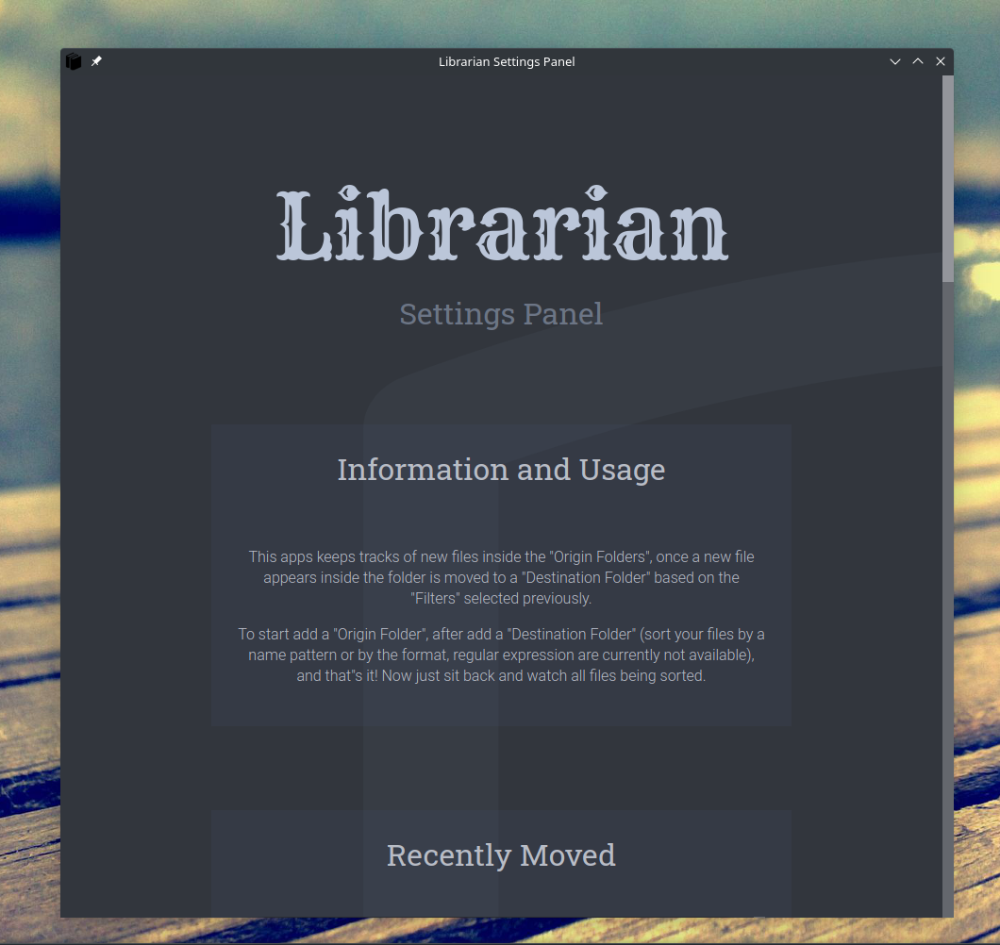

# Librarian

> Desktop made with Typescript, Electron.js, React.js, Webpack and sass. The gold is to have the program organize and make backup of our data by setting everything up just once.

## Screenshots

<!--  -->

<!-- If you have screenshots you'd like to share, include them here. -->

## Table of Contents

- [Screenshots](#screenshots)
- [General Info](#general-information)
- [Technologies Used](#technologies-used)
- [Features](#features)
- [Contribute](#development)
- [Build](#build)
- [Project Status](#project-status)
- [To do](#todo)
- [Contact](#contact)
- [License](#license)

## General Information

<!--- Provide general information about your project here.-->

- Made from the this (template)[https://www.electronforge.io/guides/framework-integration/react-with-typescript].
- The gold is to provide an UI to setup files organization and backups.
- I decided to work on this project because i see people all the time with cluttered folders.
- Initially i had a script on python that has the same functionallity has this app, but normies can't use it, so i dicided to provide UI.

<!-- You don't have to answer all the questions - just the ones relevant to your project. -->

## Technologies Used

- Typescript - 4.5.4
- React.js - 18.2.0
- Electron.js - 21.3.1

## Features

List the ready features here:

- [ ] none yet 😪.

## Contribute

`yarn start` will start the app for development if you'd like to contribute.

## Build

`yarn package` will create a folder _'out'_ in which you'll find the corresponding executables for your OS.

## Project Status

Project is: _in progress_.

<!-- ## Room for Improvement-->
<!--Include areas you believe need improvement / could be improved. Also add TODOs for future development.-->

<!--Room for improvement:-->
<!--- Improvement to be done 1-->
<!--- Improvement to be done 2-->

## TODO:

- [ ] FIX: prevent from adding folders with a lot of recursion on 'origin folders'.
- [ ] FIX: in general settings (and some other elements) there should be tooltips, to further explain what's up.
- [ ] FIX: check that the destination folder to be added it's not used anywhere else.
- [ ] FIX: move all filtering an processing logic to the reducer.
- [ ] FIX: should add pop up alerts when a folder or some other data is not correct.
- [ ] FIX: add more type checking to filters, expecially if a filter like format is added with a dot '.', should parse that correctly.
- [ ] FIX: color contrast on filters when hovered.
- [ ] FIX: if a filters window it's opened, the user can't open another and the one opened should pop up in front.
- [ ] FIX: notification messages.
- [ ] FIX: Check duplicates on adding new folders.
- [ ] FIX: Overflow of list items.
- [ ] FIX: Add shadows to button and selects.
- [ ] FIX: Select should have clicked animations.
- [ ] FIX: active outline overlapping with side bar on selected elements.
- [ ] FIX: improve Button color palette for delete and add.
- [ ] FIX: make the list and the items of the origin and destination folders it's own component.
- [ ] FIX: classnames in the origin folders.
- [ ] FIX: language not syncronizing properly with translation files.
- [ ] ADD: frontend to activate/deactivate file organization when just launched (all files that already exists inside folders).
- [ ] ADD: recursion to the origin folders.
- [ ] ADD: better animation when hovering Section, expand, better bg color and shadows.
- [ ] ADD: shift + click to select multiple items in lists.
- [ ] ADD: pop up a warning when adding more than 6 (?) filters, not adviced, maybe think of adding more folders, or using regex or format.
- [ ] ADD: theme selector (light and dark, maybe later more palettes).
- [ ] ADD: arias to buttons.
- [ ] ADD: a Checkbox element.
- [ ] ADD: navigation.
- [ ] ADD: styled Buttons for adding and deleting (green and red).
- [ ] ANIMATION: for the Section when it's hovered, fill the border with a different color like a loading animation.
- [ ] ANIMATION: to the items in the list, so the name originally it's centered and the moves to the left as the path appears.
- [ ] IMPROVE: organize all ipcMain handlers better.

## Contact

Created by [@TomiVidal99](https://www.tomasvidal.xyz/) - feel free to contact me!

<!-- Optional -->

## License

This project is open source and available under the [MIT License]().

<!-- You don't have to include all sections - just the one's relevant to your project -->
